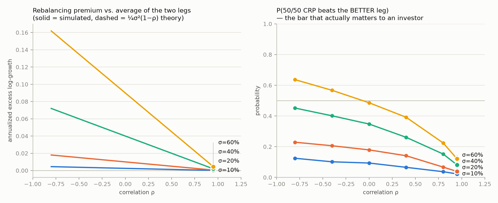
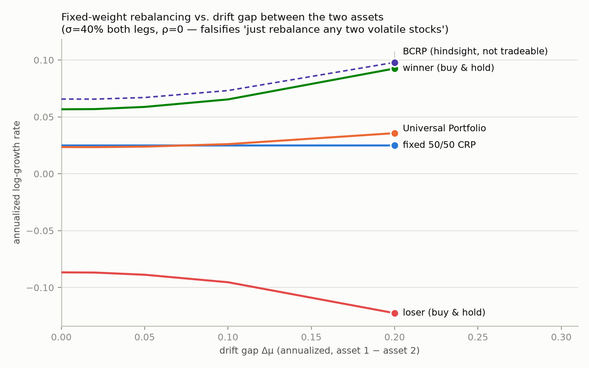
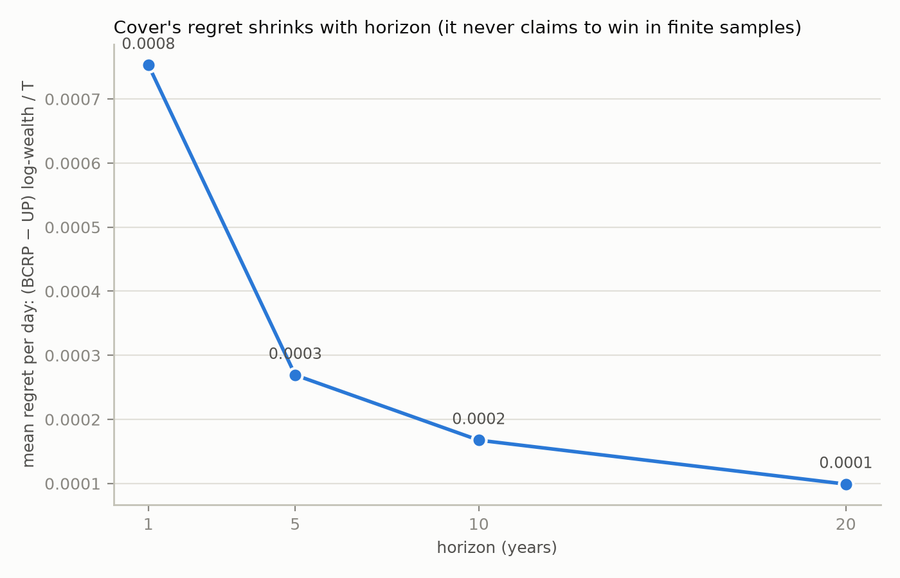
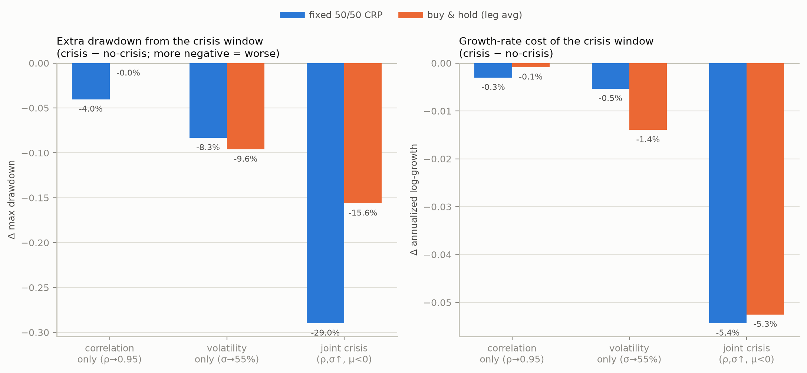
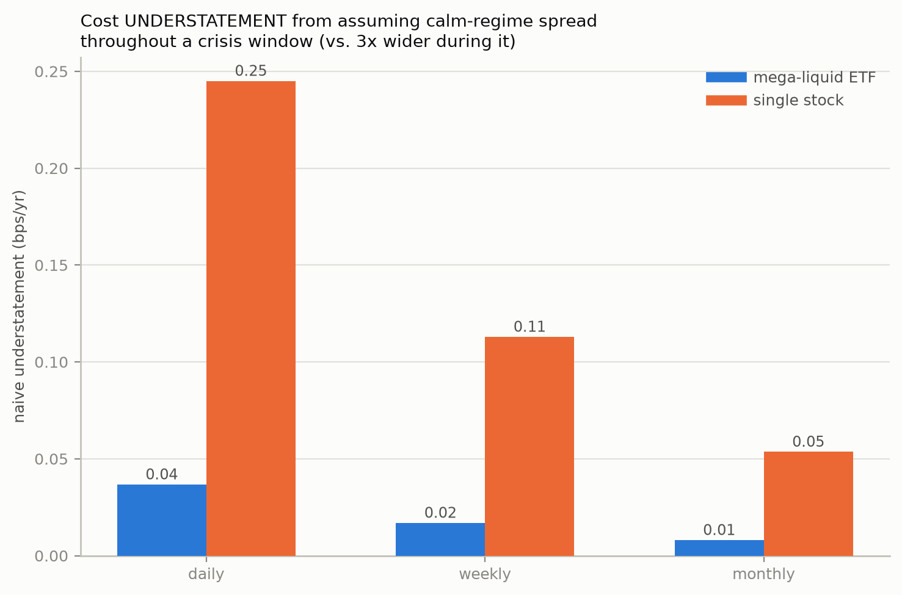
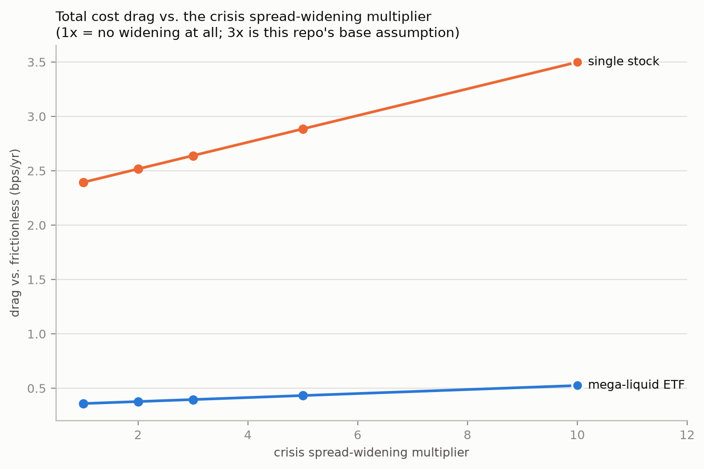
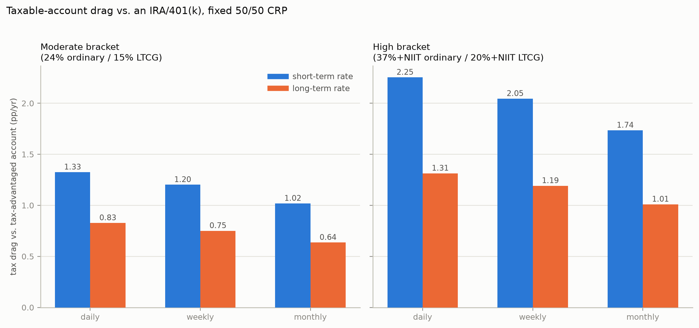
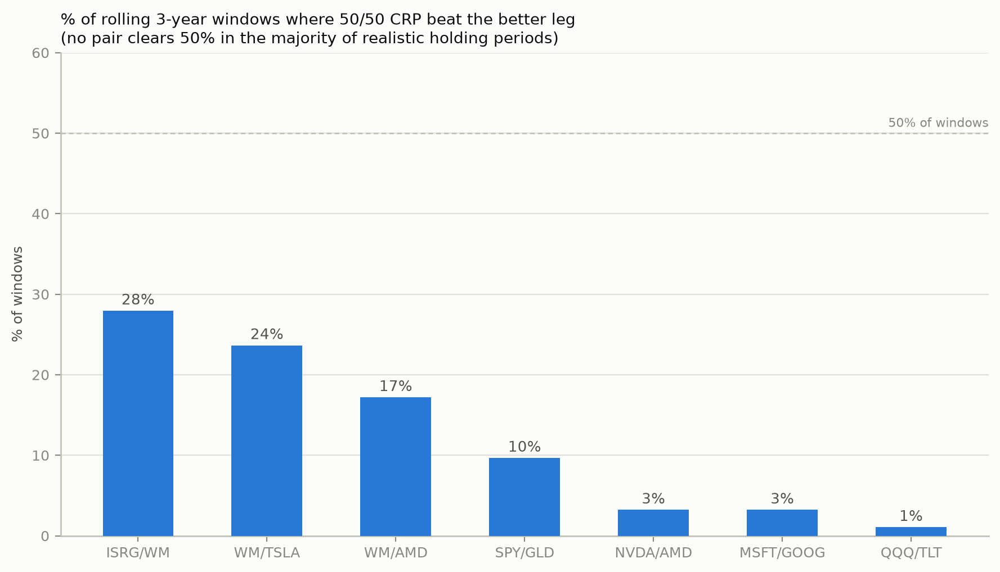
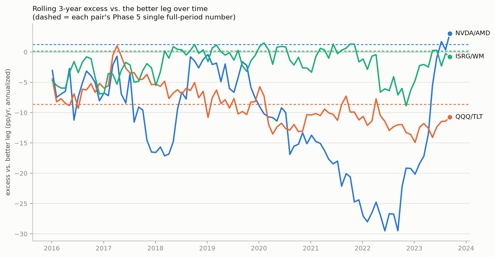

# Universal Portfolios

Research replication and stress test of Thomas Cover's 1991 **Universal Portfolio** algorithm.

Universal Portfolio is a model-free allocation method: it maintains a wealth-weighted mixture of candidate constant-rebalanced portfolios (CRPs), using no look-ahead and no return-prediction model.

## Start here

The conceptual introduction is now a standalone subproject:

### [Subproject 1 — Universal Portfolio introduction](projects/01_introduction/README.md)

It explains:

- CRP, BCRP, and Universal Portfolio;
- historical-wealth weighting;
- the discrete and continuous formulas;
- why Cover's 73.62× BCRP is a hindsight benchmark while the online UP achieved 38.67×;
- and the questions tested by the simulations: volatility, correlation, drift, horizon, regime shifts, costs, taxes, and rolling-window robustness.

The sections below document the implementation and phase-by-phase results.

## Methodology

Four-stage arc, each stage's output feeding the next:

1. **Theory** (Phase 1) — replicate Cover's own published numbers on his own
   historical dataset, single path, no simulation, to establish a
   known-correct reference implementation before trusting it on anything else.
2. **Controlled simulation** (Phases 2-3) — vectorized Monte Carlo on
   correlated-GBM paths (`n_paths` up to 20,000), first at constant
   parameters to validate the closed-form rebalancing-premium formula
   against simulation, then with parameters that shift mid-path
   (regime-switching) to stress-test it under crisis-like conditions.
3. **Frictions** (Phases 4, 6, 7) — layer real-world costs onto the same
   simulation: sourced vendor transaction costs (Phase 4), cost widening
   under the crisis regime from stage 2 (Phase 6), and realized-gain tax
   drag under an explicit account-type/bracket/frequency model (Phase 7).
4. **Real data** (Phases 5, 8, 9) — replace simulated paths with actual
   2016-2026 daily prices for 11 tickers, re-running the *same* strategy
   functions built in stages 1-3 (not a separate implementation) on realized
   history: one full-period backtest per pair (Phase 5), then a rolling
   3-year-window version to check whether the full-period read is robust or
   an artifact of this one decade (Phase 8), then Phase 7's tax model
   applied to these same real pairs instead of synthetic data (Phase 9).

Engineering discipline held constant across all nine phases:

- **Log-wealth space throughout** — avoids overflow/underflow at 20-year
  horizons and 60%+ annualized volatility.
- **Vectorized across paths**, never a per-path Python loop — `n_paths` up
  to 20,000 in a single array operation.
- **Algebraic-identity tests before empirical ones** — e.g. `BCRP ≥
  Universal Portfolio` and `universal wealth == mean(CRP wealth)` are true
  *by construction*; a test on these catches indexing/look-ahead bugs that
  a purely numerical tolerance check would miss.
- **Common random numbers** for every before/after comparison (Phases 3, 6)
  — same seed on both sides, so the only thing that differs is the one
  parameter being tested, not Monte Carlo noise.
- **A suspiciously good result is a bug signal, not a win** — restated
  explicitly at every phase boundary; Phase 8 is the one case where this
  discipline actually caught something (a full-period result that reversed
  under robustness testing — see below).

## Results at a glance

Two findings matter most, established early and confirmed at every later stage:

1. **"Beats the average of the two legs" (what the theory guarantees) and
   "beats the better of the two legs" (what an investor actually cares
   about) are different bars — rebalancing routinely clears the first while
   failing the second.** True on synthetic data (Phase 2: positive excess
   vs. the average leg in 24/24 tested (σ,ρ) combinations, but below 50%
   win probability against the better leg in 22/24) and on real data
   (Phases 5/8: negative excess vs. the better leg in most pairs and most
   rolling windows, even for genuinely low-correlation pairs like QQQ/TLT).
2. **Tax drag dwarfs every other modeled friction by 1-2 orders of magnitude:**

   | Friction | Magnitude | Source |
   |---|---:|---|
   | Transaction costs (Fidelity, ETF / single-stock) | 0.004%–0.05%/yr | Phase 4 |
   | Crisis-widened spreads | 0.0004%–0.24%/yr | Phase 6 |
   | **Tax drag** (real pairs, high bracket, daily rebalancing) | **1.3%–13.4%/yr** | Phases 7, 9 |

Method and full numbers behind both are in the phase sections below, with charts embedded inline where they were generated (`docs/images/`; regenerate anytime via the `scripts/` commands — the checked-in copies are what GitHub renders here, `results/` itself is gitignored scratch output).

## Status: Phase 1 — replication (done)

Cover's Table 8.1 (Iroquois Brands vs. Kin Ark, NYSE, 1962-07-03 to
1984-12-31) is reproduced exactly:

| Quantity | Cover (1991) | This repo |
|---|---|---|
| Iroquois Brands buy & hold | 8.9151x | 8.91511x |
| Kin Ark buy & hold | 4.1276x | 4.12759x |
| BCRP (hindsight-optimal, 55% Iroquois) | 73.619x | 73.6190x |
| Universal Portfolio (no look-ahead) | 38.6727x | 38.6727x |

**73.6x is not achievable by any real strategy** — it's the best fixed
weight *found by looking at all 22 years of future data*. The actual
Universal Portfolio algorithm, using only information available at each
point in time, reaches 38.7x. This distinction is the whole point of the
paper, and the thing most retellings of it get wrong.

```bash
pip install -r requirements.txt
python -m scripts.replicate_cover1991
pytest
```

### Data source and a format gotcha worth knowing

Data comes from the `universal-portfolios` PyPI package's bundled
`nyse_o.csv` (36 NYSE stocks, 1962–1984), not from `yfinance` — Iroquois
Brands and Kin Ark have been delisted for decades and aren't in Yahoo
Finance's coverage.

The package ships this CSV with **no ticker-name column headers** (just
single letters) and no documented format. Naively treating each column as
a day-over-day return and multiplying it through the full series produces
nonsense (some columns "compound" to e^3000+). The columns are actually
**cumulative** price relatives indexed to day 0 (`S_t = P_t / P_0`); the
last row of a column *is* its total buy-and-hold wealth multiple directly
— don't compound it further. `universal_portfolio/data.py` handles this
conversion and documents how columns `T` (Iroquois) and `W` (Kin Ark) were
identified: by matching their last-row values against Cover's published
8.9151x / 4.1276x.

## Status: Phase 2 — mechanism simulation (done)

Controlled Monte Carlo (correlated GBM, vectorized across paths — see
`universal_portfolio/simulate.py` / `strategies.py`) isolating the
rebalancing-premium effect from Cover's online-learning mechanism:

```bash
python -m scripts.mechanism_simulation   # writes CSVs + charts to results/ (gitignored)
```

**1. Rebalancing premium vs. theory** (`sigma` × `rho` sweep, `n_paths=20,000`,
symmetric drift, 10y horizon): the closed-form diversification-return
formula `excess_growth ≈ ¼σ²(1−ρ)` (Fernholz / Booth-Fama) matches simulation
to 3+ decimal places at every one of 24 (σ, ρ) combinations — e.g. σ=60%,
ρ=0 predicts 0.0900, simulates 0.0900. **But** that excess is measured
against the *average* of the two legs. Measured against the bar that
actually matters — beating the *better* leg outright — 50/50 rebalancing
loses in most of the parameter space (`P(beats better leg)` ranges
2%–63%, and is below 50% in 22 of 24 combinations; it only clears 50%
at the highest-vol/most-negative-correlation corner). This is the
rigorous version of the "rebalancing premium ≠ beats the winner" caveat
from Phase 1.



**2. Drift-difference falsification** (σ=40% both legs, ρ=0, `n_paths=5,000`,
10y horizon): as the annualized drift gap between the two assets widens
from 0% to 20%, fixed 50/50 CRP's growth rate stays flat (≈2.1%/yr — a
direct consequence of holding `μ1+μ2` fixed while widening the gap,
confirmed by the closed-form portfolio-drift formula) while the winner
leg's growth rate climbs from 5.4% to 9.6%/yr. `P(50/50 beats winner)`
falls from 34% to 18% — this *is* the "sell the winner, keep buying the
loser" failure mode, quantified. Universal Portfolio (no look-ahead)
tracks the winner somewhat better than blind 50/50 (3.5%/yr vs. 2.1%/yr
at the widest gap) but comes nowhere near BCRP's hindsight number
(10.1%/yr) — exactly the gap Phase 3 (regret) explains.



**3. Horizon convergence**: Cover's regret `R_T = (BCRP − UP) log-wealth / T`
at σ=40%, ρ=0, `n_paths=5,000` — 0.00074 (1y) → 0.00027 (5y) → 0.00016
(10y) → 0.00010 (20y). Monotonically shrinking, consistent with Cover's
asymptotic (not finite-sample) guarantee.



## Status: Phase 3 — regime-shift stress tests (done)

Phase 2 used *constant*-parameter GBM throughout each simulation. Real
crises don't hold parameters constant — correlation and volatility shift
mid-horizon, together, exactly when it hurts. `regime_shift_scenarios`
splices a crisis window into an otherwise-calm 9-year horizon (4y calm →
1y crisis → 4y calm) and compares against a same-length no-crisis
counterfactual (same seed, so only the crisis window's parameters differ —
common random numbers, for a low-noise comparison), for three crisis
definitions, `n_paths=5,000`:

| Crisis definition | Δ max drawdown, 50/50 CRP | Δ max drawdown, buy & hold (leg avg) | Δ growth/yr, CRP | Δ growth/yr, B&H |
|---|---|---|---|---|
| Correlation only (ρ: −0.3→0.95) | **−4.2%** | −0.1% | −0.3% | −0.0% |
| Volatility only (σ: 25%→55%) | −8.3% | −9.4% | −0.5% | **−1.4%** |
| Joint crisis (ρ,σ↑, μ turns negative) | **−28.8%** | −15.7% | −5.3% | −5.1% |



Two findings that directly qualify Phase 2's results:

- **Correlation-only breakdown hurts the rebalanced portfolio ~40x more
  than buy-and-hold on drawdown** (−4.2% vs. −0.1%), for essentially zero
  growth-rate cost either way. This isolates the mechanism cleanly: a
  single leg's own drawdown doesn't depend on what it's correlated with,
  but a rebalanced portfolio's risk does — directly, since the
  diversification it was relying on is what just vanished. This is
  exactly the real-world "correlations go to 1 in a crisis" phenomenon,
  and it hits rebalancing specifically, not buy-and-hold.
- **Under a realistic joint crisis, 50/50 CRP's drawdown is ~2x worse than
  buy-and-hold's** (−28.8% vs. −15.7%) despite near-identical growth-rate
  cost (−5.3% vs. −5.1%/yr). Rebalancing and buy-and-hold pay a similar
  price in terminal wealth here, but rebalancing pays it as a much sharper
  peak-to-trough hit — a distinction that matters for anything path-
  dependent (margin, redemptions, whether you hold on).

Universal Portfolio tracks fixed 50/50 CRP closely throughout this
experiment (both numbers move together in every row) — unlike Phase 2's
drift-difference test, nothing here is asymmetric enough for UP's
adaptive weighting to diverge from a static 50/50.

## Status: Phase 4 — transaction costs (done)

Phases 1-3 are all frictionless. Real rebalancing pays a cost, and — this
is the correction worth leading with — **for Fidelity, on US stock/ETF
trades, that cost is not commission.** Commission has been $0 industry-wide
(Fidelity, Schwab, Vanguard, Robinhood, E\*TRADE) since 2019; Fidelity's
sole 2026 exception (up to $100 on ~120 niche ETFs whose issuers don't
fund its revenue-sharing program, effective June 2026) explicitly excludes
SPY (SPDR), QQQ (Invesco), GLD (SPDR), and TLT (iShares) — all named as
unaffected. The real cost is exactly what you flagged: **the bid-ask
spread** — you pay the ask buying, receive the bid selling, and that gap
doesn't show up as a line-item commission. `universal_portfolio/costs.py`
sources this from Fidelity's own Q1 2026 execution-quality disclosure
(SEC Rule 605 data, Apr 2025–Mar 2026, [fidelity.com/trading/execution-quality/overview](https://www.fidelity.com/trading/execution-quality/overview)):
95.37% of shares get price improvement over the NBBO, and the average
**effective** spread — the actual gap between the NBBO midpoint and your
execution price, already net of that price improvement, i.e. what you
really pay, not the quoted spread — is **$0.0056/share**, across
Fidelity's whole Rule-605-eligible order flow (not broken out per ticker,
so not literally a SPY/QQQ-specific number). Commission facts from
[fidelity.com/trading/commissions-margin-rates](https://www.fidelity.com/trading/commissions-margin-rates), checked Sep 2026.

From that anchor plus the well-documented fact that SPY/QQQ trade with
penny-wide NBBO quoted spreads (~0.15-0.2bps at current prices), this
repo assigns its own (conservative, rounded-up, clearly-labeled-as-
assumption) one-way cost tiers: mega-liquid ETFs 0.3bps at Fidelity /
0.7bps with no price improvement (a stand-in for a lower-execution-
quality vendor, not a specific verified competitor), single stocks
2.0bps / 4.0bps. `n_paths=5,000`, calm-regime (σ=25%, ρ=−0.3) parameters
matching Phase 3, 10y horizon:

| Tier | Frequency | Fidelity drag | No-price-improvement drag |
|---|---|---|---|
| mega-liquid ETF (SPY/QQQ-like) | daily | 0.4 bps/yr | 0.9 bps/yr |
| mega-liquid ETF | monthly | 0.0 bps/yr | 0.2 bps/yr |
| single stock | daily | 2.6 bps/yr | 5.1 bps/yr |
| single stock | monthly | 0.5 bps/yr | 1.1 bps/yr |

(drag = frictionless-daily annualized growth minus the costed scenario's)


**The answer to the original concern**: for SPY/QQQ-tier liquidity at
Fidelity, the bid-ask spread is real but small enough to be a non-issue
for daily rebalancing — under 1bp/year, trivial next to Phase 2's
rebalancing premiums (which ran tens to hundreds of bps/year at realistic
vol). For single-name stocks it's more material (up to ~5bps/yr daily)
but still modest. In every scenario tested, **monthly rebalancing
recovers most of the daily cost drag** — confirming the original
analysis's suspicion that more-frequent isn't automatically better once
costs are counted, though here it's a small effect because the costs
themselves are small at this tier.

**What this deliberately doesn't cover**: spreads widen during the
crisis regime Phase 3 modeled (a well-documented market-microstructure
effect — market makers demand more compensation for adverse-selection
risk under stress) — this repo doesn't yet quantify that interaction.
More importantly, for a **taxable account**, daily rebalancing realizes
short-term capital gains every trading day, taxed as ordinary income —
almost certainly a far larger cost than the bid-ask spread for a real
investor, and entirely out of scope here (this phase covers execution
cost, not tax drag).

## Status: Phase 5 — modern out-of-sample (done)

Phases 1-4 are synthetic or academic-historical. Phase 5 uses real daily
prices, 2016-2026 (`yfinance`, auto-adjusted for splits/dividends —
confirmed directly: no discontinuity around NVDA's June 2024 10:1 split),
for 4 ETFs (SPY, QQQ, GLD, TLT) and 7 stocks spanning very different
correlation structure: same-sector pairs expected to run hot (NVDA/AMD,
MSFT/GOOG) vs. pairs anchored by WM (Waste Management — about as low-vol,
low-correlation-to-growth a stock as exists in the US market) vs.
ISRG. **This is fundamentally different evidence from Phases 2-4**: each
pair has exactly one realized historical path, not thousands of Monte
Carlo draws — there's no standard error, and a different decade could
look different. Treat it as an out-of-sample check on the mechanism, not
independent statistical proof.

```bash
python -m scripts.real_data_backtest   # writes CSV + charts to results/ (gitignored)
```

Realized full-period correlation and volatility already tell most of the
story:

| Pair | ρ (realized) | σ (leg 0 / leg 1) |
|---|---|---|
| SPY / GLD | 0.08 | 18% / 16% |
| QQQ / TLT | −0.10 | 22% / 15% |
| NVDA / AMD | 0.60 | 49% / 59% |
| MSFT / GOOG | 0.65 | 27% / 29% |
| WM / TSLA | 0.11 | 19% / 58% |
| WM / AMD | 0.13 | 19% / 59% |
| ISRG / WM | 0.36 | 32% / 19% |


**1. The ¼σ²(1−ρ) formula survives contact with real, non-lognormal,
autocorrelated market data** — realized excess-vs-average-leg tracks the
theoretical prediction within ~10% for 5 of 7 pairs (e.g. SPY/GLD:
predicted 67bps/yr, realized 68bps/yr). It's the two most extreme-vol
pairs (WM/TSLA, WM/AMD, both with a 58-59% vol leg) where the small-vol
continuous-time approximation starts to underestimate reality by
~100bps/yr — a real, if modest, breakdown at extreme volatility, not
just a synthetic-GBM artifact.

**2. Excess vs. the better leg — the bar that actually matters — is
negative in 3 of 7 pairs, and dramatically so in two**: QQQ/TLT at
**−861bps/yr** and WM/AMD at **−1249bps/yr**. Both are the same
mechanism Phase 2 warned about in the abstract, now with real tickers and
real numbers: TLT was a persistent loser over this decade (bonds'
2020-2023 bear market, annualized −1.0%/yr) and AMD was an extraordinary
persistent winner (+49.1%/yr, the AI/semiconductor supercycle) — BCRP's
hindsight weight is 100% QQQ and 0% WM respectively, i.e. *no* fixed
blend beats concentration when one leg dominates this completely. Only
NVDA/AMD, MSFT/GOOG, and ISRG/WM (the three pairs with the smallest
drift gaps between legs) show positive excess vs. the better leg.
**Read this as "2016-2026 had unusually extreme individual winners," not
"diversification is bad"** — a decade with more balanced leg returns
would look different, which is exactly Phase 2's drift-difference result
playing out in a real, specific, non-hypothetical period.

**3. Correlation regime shift, confirmed directly in real data, with a
sharper nuance than Phase 3's synthetic version**: 60-day rolling QQQ/TLT
correlation swings from −0.67 to +0.54 over the decade. During the 2020
COVID crash it went *more negative* (−0.53, flight-to-quality — bonds
rallied while stocks crashed, a "good crisis" for this pair); during the
2022 rate-hike selloff it *flipped positive* (stocks and bonds fell
together, since the shock was rates/inflation, not growth). **Whether a
crisis breaks a diversifying pair depends on the crisis's cause, not just
its existence** — a real refinement Phase 3's single "crisis regime"
couldn't show.


## Status: Phase 6 — crisis-regime cost interaction (done)

Phase 4's cost model and Phase 3's crisis regime were built independently
and never combined: Phase 4 charged a *constant* spread throughout,
including across a crisis window, even though wider spreads under stress
are well-documented (market makers demand more compensation for
adverse-selection/inventory risk). `costs.CRISIS_SPREAD_MULTIPLIER` (3x)
existed since Phase 4 but no experiment had ever exercised it. This phase
splices Phase 4's cost model onto Phase 3's calm→crisis→calm path, with
the spread 3x wider *only* during the crisis window, `n_paths=5,000`:

| Tier | Frequency | Naive (Phase 4) understates true cost by |
|---|---|---|
| mega-liquid ETF | daily | 0.04 bps/yr |
| mega-liquid ETF | monthly | 0.01 bps/yr |
| single stock | daily | 0.24 bps/yr |
| single stock | monthly | 0.05 bps/yr |



**The understatement is real and directionally as expected (worse at
higher frequency, worse for less-liquid tiers) but small in absolute
terms** — a quarter of a bp per year at worst. The reason: the crisis
window is only 1 of the 9 total years, so even a 3x spread spike during
it gets diluted into a small blended annualized effect. A sensitivity
sweep on the multiplier itself (1x = no widening, up to 10x) confirms
this isn't fragile to that stylized assumption — even at 10x, single-
stock drag only reaches 3.5bps/yr, mega-liquid-ETF drag 0.5bps/yr, both
still trivial next to Phase 2's rebalancing premiums and Phase 3's
drawdown findings.



**This closes Phase 4's flagged gap with an actual number, and the
number says the gap doesn't matter much.** Phase 3's real crisis risk —
tens of percent of extra drawdown from correlation breakdown — remains
the dominant concern; spread-widening is a real but second-order effect
on annualized growth. Worth stating plainly since it would have been easy
to assume otherwise without running the number.

## Status: Phase 7 — tax drag (done)

Flagged since Phase 4 as likely the single largest unmodeled real cost.
The premise behind that flag is worth stating precisely, since "if I
don't cash out, is there a tax event?" conflates two different rules:

- **Wash sale (IRC §1091)** disallows (defers) a *loss* deduction when
  you sell at a loss and buy the *same or substantially identical*
  security within 30 days. It never touches gains, and a two-leg
  rebalance buys a genuinely *different* asset with the proceeds — so
  wash sale doesn't apply here in the way the question assumes, on
  either side of the trade.
- **Realization (IRC §1001)** is what actually governs: every *sale*
  realizes gain/loss in that tax year, whether the proceeds are
  withdrawn or immediately reinvested in something else. "Not cashing
  out" is irrelevant in a taxable account — the sale is what matters,
  not what happens to the cash afterward.

The account *wrapper* is what actually determines this: a taxable
brokerage account taxes every rebalancing sale per the above; a
tax-advantaged account (Traditional/Roth IRA, 401(k)) doesn't tax trades
inside it at all, until distribution. That's the scenario "no tax if I
stay invested" is correctly describing — it just requires the right
wrapper, not merely reinvesting.

`strategies.fixed_crp_log_wealth_path_with_tax` adds average-cost-basis
gain/loss tracking: on each rebalance, whichever leg is overweight is
sold down to target, realizing gain/loss on the sold fraction, taxed at
a scenario rate and funded by shrinking the whole portfolio (not by
missing the target weight). `tax_drag_sweep` crosses account type/
bracket against rebalancing frequency, `n_paths=5,000`, same (μ,σ,ρ) as
Phase 3/6's calm regime:

| Bracket | Frequency | Short-term rate drag | Long-term rate drag |
|---|---|---|---|
| Moderate (24% / 15% LTCG) | daily | 1.31 pp/yr | 0.82 pp/yr |
| Moderate | monthly | 1.02 pp/yr | 0.64 pp/yr |
| High (37%+NIIT / 20%+NIIT) | daily | 2.24 pp/yr | 1.30 pp/yr |
| High | monthly | 1.73 pp/yr | 1.01 pp/yr |

(drag = tax-advantaged growth minus the taxable scenario's; **percentage
points**, not basis points — note the unit change from Phases 4 and 6)



**This is an order of magnitude larger than every other friction this
repo has modeled.** Phase 4's bid-ask spread cost daily rebalancing at
most ~5bps/yr (single-stock tier, no price improvement); Phase 6's
crisis-cost-widening added at most another quarter of a bp. Tax drag here
runs 64-224 **basis points** per year depending on bracket, holding-
period assumption, and frequency — 15-40x larger than the spread cost
that got most of the earlier attention. The flag from Phase 4 was
correctly placed.

Monthly rebalancing recovers a meaningfully larger share of this drag
than it did for spread costs (Phase 4) or crisis-widened spread costs
(Phase 6) — because tax scales with the SIZE of realized gains, and
gains compound between rebalances the same way turnover does, so
trading less often defers more of both. It's still real drag even
monthly, though: this doesn't go away at low frequency, only shrinks.

**What this simplifies, stated plainly**: average-cost-basis accounting
(IRS-permitted for some securities, not universal) rather than exact
lot-by-lot FIFO/specific-ID; short/long-term is a *scenario* rate applied
to every realized gain, not derived from actually tracking each lot's
holding period (intractable for a portfolio trading on every rebalance —
short-term is the realistic case for daily/weekly rebalancing, long-term
an optimistic bound more plausible at low frequency); a realized loss
gives an immediate full tax rebate, assuming complete offset against
other income/gains that year, versus the real $3,000/yr ordinary-income
offset cap with carryforward; state tax (e.g. up to ~13.3% top marginal
in CA) isn't included and would stack on top of every number above.

## Status: Phase 8 — rolling-window robustness check (done)

Phase 5 ran ONE full-period (2016-2026) backtest per pair — a single
point estimate, from a decade that happened to contain some of the most
extreme individual-stock winners in market history (NVDA, AMD, TSLA all
multi-bagged). `rolling_window_backtest` reuses Phase 5's `backtest_pair`
unchanged, just on overlapping 3-year sub-windows (stepped monthly, 93
windows per pair — heavily overlapping by design, not 93 independent
samples; see the function's own docstring) to check whether Phase 5's
headline finding — "excess vs. the better leg is negative in most
pairs" — is a robust property of the mechanism or an artifact of this
one window.

| Pair | Full-period excess vs. better leg | % of rolling windows that beat it | Median rolling excess |
|---|---|---|---|
| ISRG/WM | +0.2pp (positive) | 28% | −1.6pp |
| WM/TSLA | −2.9pp | 24% | −6.5pp |
| WM/AMD | −12.5pp | 17% | −9.1pp |
| SPY/GLD | −0.0pp (flat) | 10% | −2.0pp |
| **NVDA/AMD** | **+1.2pp (positive)** | **3%** | **−10.0pp** |
| **MSFT/GOOG** | **+0.2pp (positive)** | **3%** | **−2.9pp** |
| QQQ/TLT | −8.6pp | 1% | −8.8pp |



**The finding is not just confirmed, it's sharpened, and one part of
Phase 5's read needs correcting.** Every single pair's MEDIAN rolling-
window result is negative, and no pair beats the better leg in a
majority of realistic 3-year holding periods — even the least-bad pair
(ISRG/WM) only clears the bar 28% of the time. But look at the two bolded
rows: NVDA/AMD and MSFT/GOOG were the two pairs Phase 5 flagged as
genuine wins (positive full-period excess). Rolling windows show they
beat the better leg in only **3% of 3-year periods each**, with medians
of −10.0pp and −2.9pp. The full-period "win" for both was a real number,
correctly computed, but not remotely representative of what most 3-year
holders of that pair over this decade actually experienced — it was
being driven by the specific start/end points of the one window tested.

The NVDA/AMD time series makes this unambiguous: rolling excess ranges
from roughly +2pp down to **−29pp**, spending most of 2018-2023 firmly
negative (often below −15pp), and only turns positive in the handful of
3-year windows ending in the most recent AI-driven rally. The full-period
number landed in exactly that narrow favorable tail. QQQ/TLT, by
contrast, is consistently negative across nearly the entire decade —
that finding was never fragile to begin with, and this confirms it.



**Practical upshot**: don't trust a single full-period backtest for a
pair-rebalancing decision, even a real, honestly-computed one — check
the rolling distribution first. A number that looks good over one
specific decade can be almost entirely a function of where that decade
happened to start and end.

## Status: Phase 9 — tax drag on real pairs (done)

Phase 7's tax model, applied to Phase 5/8's real pairs instead of Phase
7's synthetic symmetric-drift GBM. Phase 7 assumed `mu1 == mu2` — no
persistent winner. Phase 8 showed several real pairs spend most of their
history with exactly that asymmetry (WM/AMD, NVDA/AMD both realized
deeply negative excess-vs-better-leg in most rolling windows — the
fixed-weight portfolio was persistently trimming a winner). Trimming a
winner realizes a gain almost every time, so this checks directly
whether real tax drag runs above Phase 7's calm-regime number, rather
than assuming it does:

| Pair | Daily tax drag (high bracket, short-term) | vs. Phase 7 synthetic baseline (2.24pp) | Monthly drag retained |
|---|---|---|---|
| NVDA/AMD | **13.4 pp/yr** | **6.0x** | 55% |
| WM/AMD | **11.0 pp/yr** | **4.9x** | 64% |
| WM/TSLA | 8.4 pp/yr | 3.8x | 71% |
| MSFT/GOOG | 5.9 pp/yr | 2.6x | 53% |
| ISRG/WM | 5.7 pp/yr | 2.5x | 59% |
| SPY/GLD | 4.0 pp/yr | 1.8x | 47% |
| QQQ/TLT | 2.9 pp/yr | 1.3x | 68% |


**Every real pair exceeds Phase 7's synthetic baseline — even SPY/GLD,
the "boring" ETF pair, runs 1.8x higher.** But the two pairs Phase 8
flagged as persistent-winner dynamics are dramatically worse: NVDA/AMD's
real daily tax drag is **6x** the synthetic calm-regime number. This
directly confirms the hypothesis raised when Phase 8 found those pairs'
full-period "wins" were narrow-tail artifacts — the SAME mechanism (a
fixed weight relentlessly trimming a persistent winner) that made
rebalancing underperform the better leg in most rolling windows is, in a
taxable account, also what makes it realize a gain almost every single
rebalance. Phase 7's headline "64-224bps/yr" framing, already large,
understated the risk for exactly the high-dispersion pairs this project
kept returning to.

**Rebalancing less often helps, but doesn't rescue a persistent-winner
pair.** Monthly rebalancing retains 47-71% of the daily drag across all
seven pairs — for NVDA/AMD that's still **7.4pp/yr**, more than 3x
Phase 7's original *daily* synthetic figure. Lower frequency mitigates
tax drag here the same directional way it did in Phase 7, but the
starting point is high enough that it doesn't get you back to "small."

## Layout

- `universal_portfolio/cover.py` — Phase 1: the reference algorithm (`cover_universal_2asset`), single-path, no external data dependency.
- `universal_portfolio/data.py` — Phase 1: NYSE(O) dataset loader + the cumulative→period conversion.
- `universal_portfolio/simulate.py` — Phase 2: correlated-GBM path generator; Phase 3: `Regime` + `simulate_regime_switching_gbm` for piecewise-constant-parameter paths.
- `universal_portfolio/strategies.py` — Phase 2: the same algorithms as `cover.py`, vectorized across simulation paths (log-wealth space throughout, for numerical stability at 20-year/60%-vol horizons); cross-checked against `cover.py` in tests. Phase 3: `*_path` variants that expose the full trajectory (not just final wealth) + `max_drawdown_from_log_wealth_path`. Phase 4: `cost_bps`/`rebalance_every` on the fixed-CRP and Universal Portfolio path functions. Phase 6: `cost_bps` accepts either a scalar or a per-day array, for a cost that varies with the regime. Phase 7: `fixed_crp_log_wealth_path_with_tax`, average-cost-basis gain/loss tracking and tax.
- `universal_portfolio/costs.py` — Phase 4: sourced commission + effective-spread assumptions by vendor and liquidity tier; the `crisis` flag and `CRISIS_SPREAD_MULTIPLIER` (defined here since Phase 4, first actually used in Phase 6).
- `universal_portfolio/taxes.py` — Phase 7: the realization-vs-wash-sale explanation, and sourced 2026 short-term/long-term/NIIT rate scenarios.
- `universal_portfolio/market_data.py` — Phase 5: real price fetch/cache (`yfinance`) + conversion to the same price-relative convention used throughout.
- `universal_portfolio/real_data_experiments.py` — Phase 5: pair backtests + rolling correlation on real data, reusing Phase 2-4's `strategies.py` functions with `n_paths=1` instead of a Monte Carlo batch. Phase 8: `rolling_window_backtest`/`rolling_window_summary`, repeating `backtest_pair` over overlapping sub-windows instead of the one full period. Phase 9: `tax_drag_on_real_pairs`/`tax_drag_summary`, applying Phase 7's `fixed_crp_log_wealth_path_with_tax` to these same real pairs.
- `universal_portfolio/experiments.py` — Phases 2-4, 6, and 7: the synthetic-data experiments, as pure functions returning DataFrames.
- `universal_portfolio/plotting.py` — chart rendering.
- `scripts/replicate_cover1991.py`, `scripts/mechanism_simulation.py`, `scripts/real_data_backtest.py` — CLI entry points.
- `tests/test_cover_replication.py` — Phase 1 tests: exact-number replication, the `universal wealth == mean(CRP wealth)` algebraic identity (true by construction, so it's what actually catches indexing/look-ahead bugs), a cross-check against `universal-portfolios`' own BCRP optimizer.
- `tests/test_strategies.py` — Phase 2-4, 6, 7 tests: batched implementation vs. Phase 1's single-path reference, the same algebraic identity batched, `BCRP ≥ Universal Portfolio` always (also algebraic, not empirical), GBM simulator calibration (including per-regime calibration), drawdown correctness on hand-constructed paths, Phase 4's cost/frequency mechanics (including a caught-by-testing subtlety: rebalancing frequency changes the underlying wealth process even at zero cost, since the weight drifts between rebalances — cost and "structural" frequency effects had to be tested separately, not conflated), Phase 6's array-valued cost (a constant array must reproduce the scalar exactly; a cost confined to a sub-window must leave the path untouched before that window starts), and Phase 7's tax mechanics (a hand-computed 2-day example verifying the realized-gain arithmetic; a caught-by-testing subtlety of its own — unlike Phase 4's cost, which is always >=0, a realized LOSS gives a tax rebate under this model's full-offset assumption, so "tax reduces wealth" only holds on AVERAGE across paths, not on every individual path, and the test had to be corrected to check the mean, not `np.all`).
- `tests/test_real_data.py` — Phase 5 tests: sane price-relative bounds (loose on purpose — AMD alone had a real +52%/-24% single day in this window), BCRP ≥ fixed CRP and costed ≤ frictionless on real data, theory-vs-reality direction/scale, rolling correlation stays in [-1, 1]. Needs a local cache or network access; skips (doesn't fail) if neither is available, since Phase 5 is inherently network-dependent in a way Phases 1-4 aren't. Phase 8 tests: rolling-window mechanics (one row per window per pair, correct window length, per-window internal consistency) and that the summary's aggregates match recomputing them directly from the raw rolling output. Phase 9 tests: real-pair tax drag is internally consistent (zero-rate baseline, every taxed scenario below it, short-term drags more than long-term at the same bracket) and the summary matches manual recomputation.
- `docs/images/` — checked-in copies of the charts embedded above, one per experiment, named `phaseN_<experiment>.png`. Regenerated by the `scripts/` commands into `results/` (gitignored — treat as scratch); when a chart changes, re-copy the relevant file from `results/` into `docs/images/` so the README stays in sync.

## Planned next phases

Not yet implemented:

1. **Exact lot accounting** — replace Phase 7/9's average-cost-basis/scenario-rate simplifications with real FIFO or specific-ID lot tracking and per-lot holding periods, closing the short-term/long-term gap the current model treats as a scenario choice rather than a derived quantity. Now more clearly worth doing: Phase 9 shows the scenario choice swings the answer by 2x on some real pairs (e.g. WM/TSLA: 8.4pp short-term vs. an implied ~5pp at long-term rates), and actual lot-level holding periods on a persistent-winner pair are plausible enough to check for real, not just bound.
2. **Why does the rolling window bounce so hard around 2020-2022 for NVDA/AMD?** Phase 8 shows the swing (roughly +2pp to -29pp) but doesn't decompose it — plausibly some mix of the 2022 semiconductor selloff and shifting relative correlation/vol between the two names, not investigated here.
3. **Rolling-window tax drag** — Phase 9 used the one full 2016-2026 period per pair, the same limitation Phase 8 found in Phase 5's non-tax numbers; a rolling-window version of Phase 9 would show whether the 6x-vs-synthetic-baseline finding for NVDA/AMD is itself concentrated in specific sub-periods or holds throughout.
