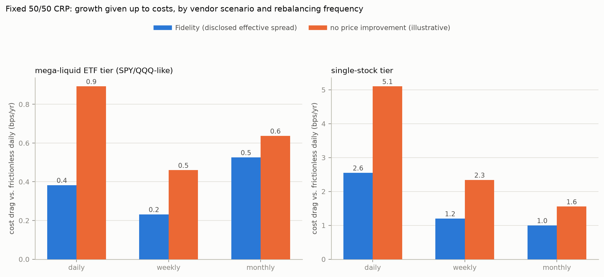

# Phase 4 — transaction costs

[Project overview](../../README.md) · [Introduction](../01_introduction/README.md) · [Previous: Phase 3](../phase_03_regime_shift/README.md) · [Next: Phase 5](../phase_05_real_data/README.md)

Status: complete. Run any commands below from the repository root.

Phases 1-3 are all frictionless. Real rebalancing pays a cost, and — this
is the correction worth leading with — **for Fidelity, on US stock/ETF
trades, that cost is not commission.** Commission has been $0 industry-wide
(Fidelity, Schwab, Vanguard, Robinhood, E\*TRADE) since 2019; Fidelity's
sole 2026 exception (up to $100 on ~120 niche ETFs whose issuers don't
fund its revenue-sharing program, effective June 2026) explicitly excludes
SPY (SPDR), QQQ (Invesco), GLD (SPDR), and TLT (iShares) — all named as
unaffected. The real cost is exactly what you flagged: **the bid-ask
spread** — you pay the ask buying, receive the bid selling, and that gap
doesn't show up as a line-item commission. `universal_portfolio/costs.py`
sources this from Fidelity's own Q1 2026 execution-quality disclosure
(SEC Rule 605 data, Apr 2025–Mar 2026, [fidelity.com/trading/execution-quality/overview](https://www.fidelity.com/trading/execution-quality/overview)):
95.37% of shares get price improvement over the NBBO, and the average
**effective** spread — the actual gap between the NBBO midpoint and your
execution price, already net of that price improvement, i.e. what you
really pay, not the quoted spread — is **$0.0056/share**, across
Fidelity's whole Rule-605-eligible order flow (not broken out per ticker,
so not literally a SPY/QQQ-specific number). Commission facts from
[fidelity.com/trading/commissions-margin-rates](https://www.fidelity.com/trading/commissions-margin-rates), checked Sep 2026.

From that anchor plus the well-documented fact that SPY/QQQ trade with
penny-wide NBBO quoted spreads (~0.15-0.2bps at current prices), this
repo assigns its own (conservative, rounded-up, clearly-labeled-as-
assumption) one-way cost tiers: mega-liquid ETFs 0.3bps at Fidelity /
0.7bps with no price improvement (a stand-in for a lower-execution-
quality vendor, not a specific verified competitor), single stocks
2.0bps / 4.0bps. `n_paths=5,000`, calm-regime (σ=25%, ρ=−0.3) parameters
matching Phase 3, 10y horizon:

| Tier | Frequency | Fidelity drag | No-price-improvement drag |
|---|---|---|---|
| mega-liquid ETF (SPY/QQQ-like) | daily | 0.4 bps/yr | 0.9 bps/yr |
| mega-liquid ETF | monthly | 0.0 bps/yr | 0.2 bps/yr |
| single stock | daily | 2.6 bps/yr | 5.1 bps/yr |
| single stock | monthly | 0.5 bps/yr | 1.1 bps/yr |

(drag = frictionless-daily annualized growth minus the costed scenario's)

**The answer to the original concern**: for SPY/QQQ-tier liquidity at
Fidelity, the bid-ask spread is real but small enough to be a non-issue
for daily rebalancing — under 1bp/year, trivial next to Phase 2's
rebalancing premiums (which ran tens to hundreds of bps/year at realistic
vol). For single-name stocks it's more material (up to ~5bps/yr daily)
but still modest. In every scenario tested, **monthly rebalancing
recovers most of the daily cost drag** — confirming the original
analysis's suspicion that more-frequent isn't automatically better once
costs are counted, though here it's a small effect because the costs
themselves are small at this tier.

**What this deliberately doesn't cover**: spreads widen during the
crisis regime Phase 3 modeled (a well-documented market-microstructure
effect — market makers demand more compensation for adverse-selection
risk under stress) — this repo doesn't yet quantify that interaction.
More importantly, for a **taxable account**, daily rebalancing realizes
short-term capital gains every trading day, taxed as ordinary income —
almost certainly a far larger cost than the bid-ask spread for a real
investor, and entirely out of scope here (this phase covers execution
cost, not tax drag).
