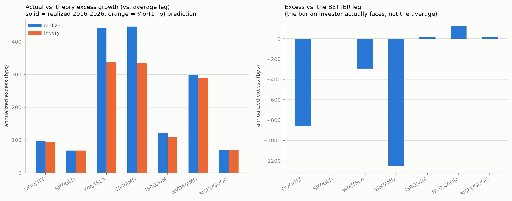
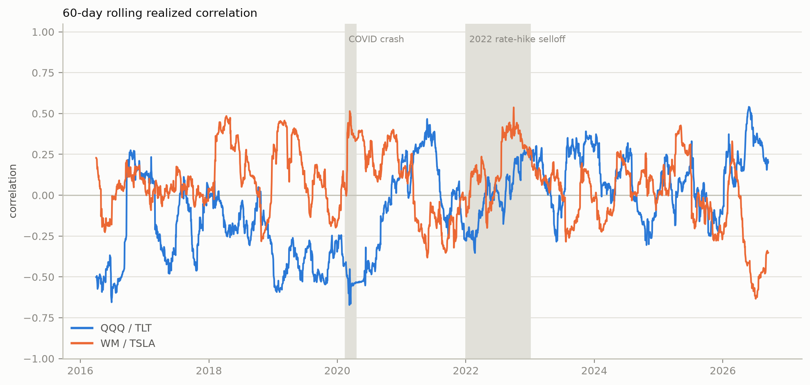

# Phase 5 — modern out-of-sample

[Project overview](../../README.md) · [Introduction](../01_introduction/README.md) · [Previous: Phase 4](../phase_04_transaction_costs/README.md) · [Next: Phase 6](../phase_06_crisis_costs/README.md)

Status: complete. Run any commands below from the repository root.

Phases 1-4 are synthetic or academic-historical. Phase 5 uses real daily
prices, 2016-2026 (`yfinance`, auto-adjusted for splits/dividends —
confirmed directly: no discontinuity around NVDA's June 2024 10:1 split),
for 4 ETFs (SPY, QQQ, GLD, TLT) and 7 stocks spanning very different
correlation structure: same-sector pairs expected to run hot (NVDA/AMD,
MSFT/GOOG) vs. pairs anchored by WM (Waste Management — about as low-vol,
low-correlation-to-growth a stock as exists in the US market) vs.
ISRG. **This is fundamentally different evidence from Phases 2-4**: each
pair has exactly one realized historical path, not thousands of Monte
Carlo draws — there's no standard error, and a different decade could
look different. Treat it as an out-of-sample check on the mechanism, not
independent statistical proof.

```bash
python -m scripts.real_data_backtest   # writes CSV + charts to results/ (gitignored)
```

Realized full-period correlation and volatility already tell most of the
story:

| Pair | ρ (realized) | σ (leg 0 / leg 1) |
|---|---|---|
| SPY / GLD | 0.08 | 18% / 16% |
| QQQ / TLT | −0.10 | 22% / 15% |
| NVDA / AMD | 0.60 | 49% / 59% |
| MSFT / GOOG | 0.65 | 27% / 29% |
| WM / TSLA | 0.11 | 19% / 58% |
| WM / AMD | 0.13 | 19% / 59% |
| ISRG / WM | 0.36 | 32% / 19% |



**1. The ¼σ²(1−ρ) formula survives contact with real, non-lognormal,
autocorrelated market data** — realized excess-vs-average-leg tracks the
theoretical prediction within ~10% for 5 of 7 pairs (e.g. SPY/GLD:
predicted 67bps/yr, realized 68bps/yr). It's the two most extreme-vol
pairs (WM/TSLA, WM/AMD, both with a 58-59% vol leg) where the small-vol
continuous-time approximation starts to underestimate reality by
~100bps/yr — a real, if modest, breakdown at extreme volatility, not
just a synthetic-GBM artifact.

**2. Excess vs. the better leg — the bar that actually matters — is
negative in 3 of 7 pairs, and dramatically so in two**: QQQ/TLT at
**−861bps/yr** and WM/AMD at **−1249bps/yr**. Both are the same
mechanism Phase 2 warned about in the abstract, now with real tickers and
real numbers: TLT was a persistent loser over this decade (bonds'
2020-2023 bear market, annualized −1.0%/yr) and AMD was an extraordinary
persistent winner (+49.1%/yr, the AI/semiconductor supercycle) — BCRP's
hindsight weight is 100% QQQ and 0% WM respectively, i.e. *no* fixed
blend beats concentration when one leg dominates this completely. Only
NVDA/AMD, MSFT/GOOG, and ISRG/WM (the three pairs with the smallest
drift gaps between legs) show positive excess vs. the better leg.
**Read this as "2016-2026 had unusually extreme individual winners," not
"diversification is bad"** — a decade with more balanced leg returns
would look different, which is exactly Phase 2's drift-difference result
playing out in a real, specific, non-hypothetical period.

**3. Correlation regime shift, confirmed directly in real data, with a
sharper nuance than Phase 3's synthetic version**: 60-day rolling QQQ/TLT
correlation swings from −0.67 to +0.54 over the decade. During the 2020
COVID crash it went *more negative* (−0.53, flight-to-quality — bonds
rallied while stocks crashed, a "good crisis" for this pair); during the
2022 rate-hike selloff it *flipped positive* (stocks and bonds fell
together, since the shock was rates/inflation, not growth). **Whether a
crisis breaks a diversifying pair depends on the crisis's cause, not just
its existence** — a real refinement Phase 3's single "crisis regime"
couldn't show.


