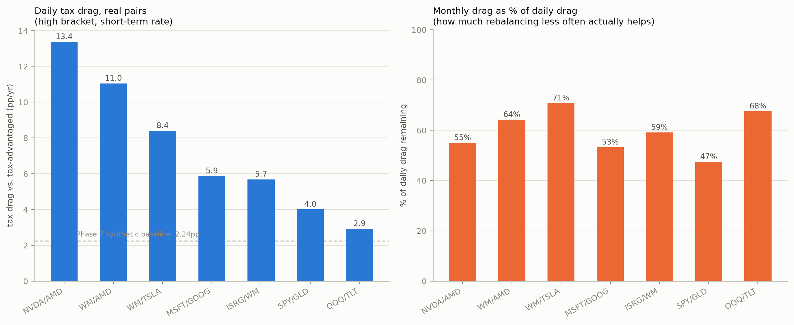

# Phase 9 — tax drag on real pairs

[Project overview](../../README.md) · [Introduction](../01_introduction/README.md) · [Previous: Phase 8](../phase_08_rolling_windows/README.md)

Status: complete. Run any commands below from the repository root.

Phase 7's tax model, applied to Phase 5/8's real pairs instead of Phase
7's synthetic symmetric-drift GBM. Phase 7 assumed `mu1 == mu2` — no
persistent winner. Phase 8 showed several real pairs spend most of their
history with exactly that asymmetry (WM/AMD, NVDA/AMD both realized
deeply negative excess-vs-better-leg in most rolling windows — the
fixed-weight portfolio was persistently trimming a winner). Trimming a
winner realizes a gain almost every time, so this checks directly
whether real tax drag runs above Phase 7's calm-regime number, rather
than assuming it does:

| Pair | Daily tax drag (high bracket, short-term) | vs. Phase 7 synthetic baseline (2.24pp) | Monthly drag retained |
|---|---|---|---|
| NVDA/AMD | **13.4 pp/yr** | **6.0x** | 55% |
| WM/AMD | **11.0 pp/yr** | **4.9x** | 64% |
| WM/TSLA | 8.4 pp/yr | 3.8x | 71% |
| MSFT/GOOG | 5.9 pp/yr | 2.6x | 53% |
| ISRG/WM | 5.7 pp/yr | 2.5x | 59% |
| SPY/GLD | 4.0 pp/yr | 1.8x | 47% |
| QQQ/TLT | 2.9 pp/yr | 1.3x | 68% |

**Every real pair exceeds Phase 7's synthetic baseline — even SPY/GLD,
the "boring" ETF pair, runs 1.8x higher.** But the two pairs Phase 8
flagged as persistent-winner dynamics are dramatically worse: NVDA/AMD's
real daily tax drag is **6x** the synthetic calm-regime number. This
directly confirms the hypothesis raised when Phase 8 found those pairs'
full-period "wins" were narrow-tail artifacts — the SAME mechanism (a
fixed weight relentlessly trimming a persistent winner) that made
rebalancing underperform the better leg in most rolling windows is, in a
taxable account, also what makes it realize a gain almost every single
rebalance. Phase 7's headline "64-224bps/yr" framing, already large,
understated the risk for exactly the high-dispersion pairs this project
kept returning to.

**Rebalancing less often helps, but doesn't rescue a persistent-winner
pair.** Monthly rebalancing retains 47-71% of the daily drag across all
seven pairs — for NVDA/AMD that's still **7.4pp/yr**, more than 3x
Phase 7's original *daily* synthetic figure. Lower frequency mitigates
tax drag here the same directional way it did in Phase 7, but the
starting point is high enough that it doesn't get you back to "small."
